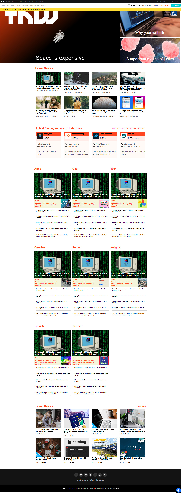

# Project Name
The Next Web - Responsive Clone
=======

This is Brandon's The Next Web responsiveness project

Additional description about the project and its features.

This project was compiled by Brandon in the Microverse HTML/CSS section of the course work. It involved recreating The Next Web's homepage.

## Built With

- HTML and CSS
- Atom
- Windows10
- https://validator.w3.org was used to validate the HTML code in this project
- Linters used include Lighthouse, Webhint, and Stylelint

## Live Demo

[Live Demo Link](https://rawcdn.githack.com/defoebrand/TNW-responsive-design/e973ce89d3f927c3e83d72db3eaf6b1dda2d9fb1/index.html)

## Getting Started

To get your own copy of our project clone the repository to your local machine.

## Authors

👤 **Brandon Defoe**

- Github: [@defoebrand](https://github.com/defoebrand)
- Gmail: defoe.brand@gmail.com

## 🤝 Contributing

Contributions, issues and feature requests are welcome!

Feel free to check the [issues page](issues/).

## Show your support

Give a ⭐️ if you like this project!

## Acknowledgments

-

## 📝 License

This project is licensed by Microverse and The Odin Project
=======
